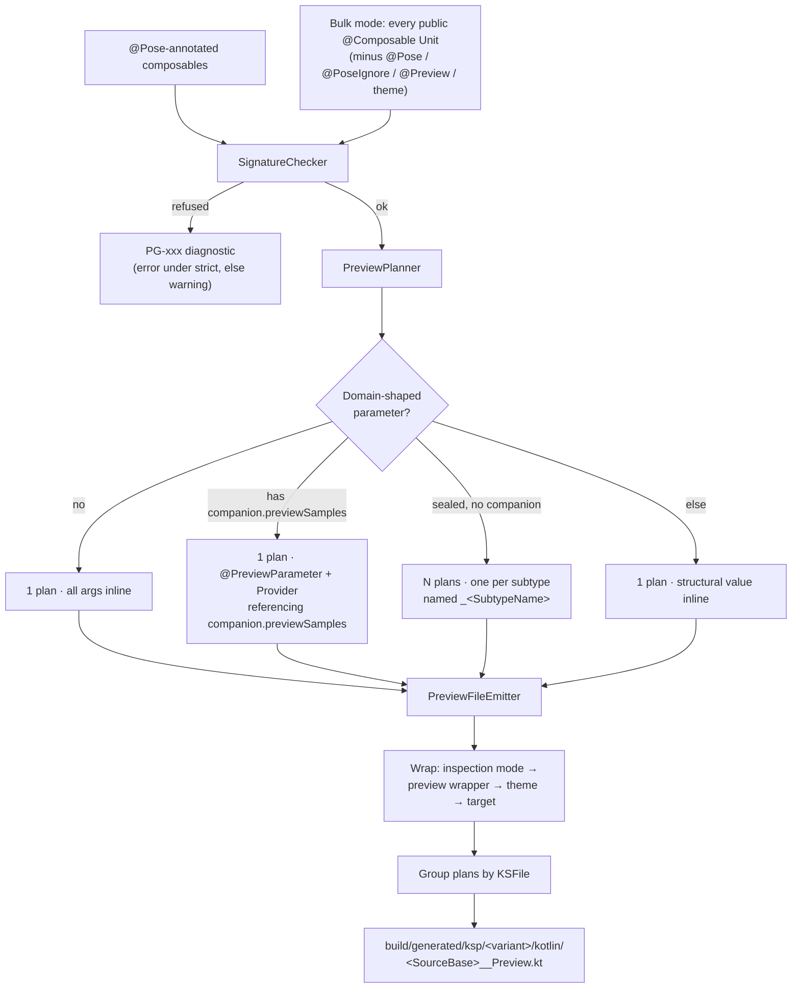

# Contributing to Pose

Thanks for considering a contribution.

## Development

First-time setup - activate the shared pre-push hook (one-off, per clone):

```bash
git config core.hooksPath .githooks
```

Then:

```bash
./gradlew build :intellij-plugin:buildPlugin   # full verification - what pre-push runs
./gradlew :processor:test                      # fast loop
./gradlew :intellij-plugin:test                # IDE-plugin tests
```

`Run → Verify Everything` in the IDE runs the same full verification. Requires JDK 17; Gradle wraps everything else.

## Project layout

| Coordinate / path                           | Purpose                                                                         | Configuration in consumers     |
|---------------------------------------------|---------------------------------------------------------------------------------|--------------------------------|
| `io.github.akshaychordiya.pose:annotations` | `@Pose`, `@PoseSample`, `@PoseIgnore`, `PoseConfig` / `@PoseSetup`              | `implementation`               |
| `io.github.akshaychordiya.pose:processor`   | The KSP2 symbol processor (pure Kotlin JVM JAR)                                 | `kspDebug` / `ksp<Target>Main` |
| `intellij-plugin`                           | JetBrains Marketplace plugin - gutter icons that jump to the generated previews | installed from Marketplace     |
| `sample-app`                                | End-to-end smoke test; one file per Pose capability                             | not published                  |

The annotations JAR carries the markers plus `PoseConfig` / `@PoseSetup`. It applies the Compose compiler plugin and takes `compose-runtime` as **`compileOnly`** - `PoseConfig` declares `@Composable` members, and a `@Composable` function's JVM signature differs depending on whether the Compose compiler processed it, so the bytecode must be Compose-compatible. Because `compileOnly` doesn't publish, the POM still has zero Compose dependencies and the marker annotations remain usable without Compose on the classpath.

**Don't add non-`compileOnly` dependencies to it.** Consumers should not pull Compose tooling transitively just by depending on the markers. If you change this, verify with `./gradlew :annotations:generatePomFileForMavenPublication` and check `annotations/build/publications/maven/pom-default.xml` still lists only `kotlin-stdlib`.

The processor consumes `symbol-processing-api` and `kotlinpoet-ksp`; it never depends on the annotations JAR at runtime (only reads annotation FQNs from source symbols).

The IntelliJ plugin is versioned and released **independently** of the KSP artifacts - see [PUBLISHING.md](PUBLISHING.md). It compiles against Kotlin 2.0 language level (not the repo's 2.4) so its bytecode stays loadable by the Kotlin bundled in Android Studio Ladybug.

## Processor pipeline



Key invariants:

- **KSP can only emit new files, not modify existing ones.** Every generated preview lives in the `build/generated/` tree; the developer's source is never touched.
- **Determinism.** Sample values are seeded from a hash of `(composable FQN, parameter path, type FQN)`. No `Random`, no clock, no classpath-iteration-order.
- **One file per KSFile.** All previews for composables declared in `Foo.kt` land in `Foo__Preview.kt`. The emitter groups plans by containing file and writes each grouped file once.

### Per-parameter resolution order

The pipeline shapes above (Simple / Companion / Fanout / Structural) decide the plan skeleton. Every remaining parameter inside a plan is then filled by `buildSinglePlan`, first match wins:

1. **`@PoseSample` on the parameter**, else a `@Pose(providers = [...])` entry whose `PreviewParameterProvider<T>` generic matches the parameter's type. Emits `<Provider>().values.first()` inline.
2. **`SampleResolver` tier ladder** - T0 default → T1 well-known FQN → T2 structural synthesis → refusal.

The provider-slot param (the one that carries `@PreviewParameter` in the generated function) is exempt from step 1 - it's already handled by the plan shape (companion sequence or sealed fan-out).

## Where each concern lives

| Concern                                                                                | File                      |
|----------------------------------------------------------------------------------------|---------------------------|
| Detect `@Pose` annotation, drive the pipeline                                          | `PoseProcessor`           |
| Find + validate the module's `@PoseSetup` object                                       | `PoseSetupResolver`       |
| Validate signature (visibility, receivers, generics, refuse-category params)           | `SignatureChecker`        |
| Decide the emission shape (inline vs companion vs sealed fan-out)                      | `PreviewPlanner`          |
| Match `@Pose(providers = [...])` entries to parameters                                 | `PreviewPlanner`          |
| Recursive structural synthesis of values                                               | `SampleResolver`          |
| Well-known types (Compose value classes, `Flow`, `java.time`, refuse-category list)    | `FqnTable`                |
| Function-type lambda placeholders (`() -> Unit`, `@Composable BoxScope.() -> Unit`, …) | `FunctionTypeSynthesizer` |
| KotlinPoet emission + wrapper layers                                                   | `PreviewFileEmitter`      |
| KSP-arg parsing                                                                        | `Options`                 |
| Diagnostic codes + strict/lenient routing                                              | `Diagnostics`             |
| Source → generated-file mapping for gutter icons                                       | `GeneratedPreviewLocator` |
| Gutter icon + navigation targets                                                       | `PoseLineMarkerProvider`  |

## Platform notes

Pose works on Android and on Kotlin Multiplatform / Compose Multiplatform. `androidx.compose.ui.tooling.preview.Preview` is the shared annotation FQN across both, so the emitted code needs no per-target branching.

- **Variant / source-set selection is the consumer's job, not the processor's.** Consumers pick `kspDebug`, `kspReleaseKotlin`, `ksp<Target>Main`, etc. in their Gradle file - the processor never needs to know which one it's running for. Don't reintroduce a `pose.variants` knob.
- **Cross-artifact symbol references must be classpath-gated.** `PoseProcessor` resolves `LocalInspectionMode` before emitting the inspection-mode wrapper, because it lives in `compose-ui` while `@Composable` lives in `compose-runtime` - a module could plausibly have one without the other. Follow this pattern for any new symbol that isn't in the same artifact as the type that triggered it. `FqnTable` entries don't do this yet; if you add a cross-artifact entry, extend `FqnTable.Emitter` with a `requiredFqns: Set<String>` and gate lookup in `SampleResolver`.
- **The `annotations` module has zero platform-specific code.** It's `kotlin("jvm")` for convenience; converting to `kotlin("multiplatform")` with a single `commonMain` source set would be a pure Gradle change if a consumer ever needs the KLib.
- **The processor is JVM-only forever.** KSP2 processors run at build time on the JVM regardless of the target the generated code is going into.
- **KSP output nesting differs by build type.** Android is `ksp/<variant>/kotlin/…`; KMP is `ksp/<target>/<sourceSet>/kotlin/…`. `GeneratedPreviewLocator` walks both via bounded BFS - keep that in mind if you touch the plugin's file lookup.

## Common contribution shapes

### Adding a type to the FQN table

Extend `FqnTable.SimpleEmitters` (fixed expression) or `FqnTable.GenericEmitters` (recursive on a type argument). Prefer types that appear commonly in production Compose signatures - one-off vendor types belong in a wrapper you own, not in the frozen table.

Add a test in `processor/src/test/kotlin/` covering the new entry.

### Adding a refusal rule

Extend `SignatureChecker` or the `SampleResolver` path. Assign a new `DiagnosticCode` (`PGxxx`) - **never reuse a retired code**, so old build logs stay unambiguous - and update:

- `Diagnostics.kt` - the enum entry
- `docs/refusals.md` - a section with the matching `#pgxxx` anchor. Diagnostic messages link here, so a missing section is a broken link.
- `README.md` - the refusal list, if user-visible
- A test in `RefusalTest.kt`

Refusal messages must name the composable, give a concrete fix (rewrite skeleton, provider snippet, or config change), and end with the docs URL from `code.docsUrl`.

### Adding a KSP option

Extend `Options` (the data class + `from()` parser) with a default, then:

- Wire it where it's consumed - usually `PoseProcessor` or `PreviewFileEmitter`
- Add it to `README.md`'s option table
- Cover it in `OptionsTest.kt`, plus a behavioral test if it changes emitted output
- Note it in `CHANGELOG.md`

If the option makes the processor emit a reference to a symbol from an artifact the consumer might not have, resolve it first and degrade silently - see the classpath-gating note under Platform notes.

## Testing conventions

**Processor tests** use [`dev.zacsweers.kctfork`](https://github.com/tschuchortdev/kotlin-compile-testing) (a KSP2-aware fork of `kotlin-compile-testing`). Each test:

1. Constructs `SourceFile.kotlin` fixtures with a small composable plus any stubs it needs
2. Runs them through `CompileHarness.compile(...)`, optionally with a KSP `options` map
3. Asserts on the generated file contents (`generatedFile("Foo__Preview.kt").readText()`) or the compiler messages (`result.messages`, for refusals)

The harness compiles the generated code too, so if your change emits a new symbol you'll need a stub for it in `CompileHarness.STUBS` - otherwise every test fails to compile.

**Plugin tests** use `BasePlatformTestCase` (a light in-memory IntelliJ project). Lay out mock file trees with `myFixture.tempDirFixture`, call `myFixture.doHighlighting()`, then assert on `myFixture.findAllGutters()`. Filter by tooltip text - `findAllGutters()` returns markers from every registered provider, not just ours.

Don't mock KSP or IntelliJ internals - both harnesses give you real behaviour.

## Releasing

Two independent cadences: `v*` tags publish the KSP artifacts to Maven Central, `plugin-v*` tags publish the IntelliJ plugin to JetBrains Marketplace. Full walkthrough in [PUBLISHING.md](PUBLISHING.md). Don't conflate them - a processor patch shouldn't republish an unchanged plugin.

## Style

- KDoc on public API, keep it minimal - WHY, not WHAT.
- `explicitApi()` is enabled on the annotations and processor modules; declare visibility.
- No comments on obvious code. Comments explain non-obvious constraints or workarounds.
- Deterministic output: never `Random`, never clock, never classpath-iteration-order.

## Reporting issues

Please include:

- Kotlin, KSP, AGP, and Compose BOM versions.
- Minimal repro composable + the `PG-xxx` diagnostic if one fired.
- Generated file contents (if any) from `build/generated/ksp/debug/kotlin/`.
