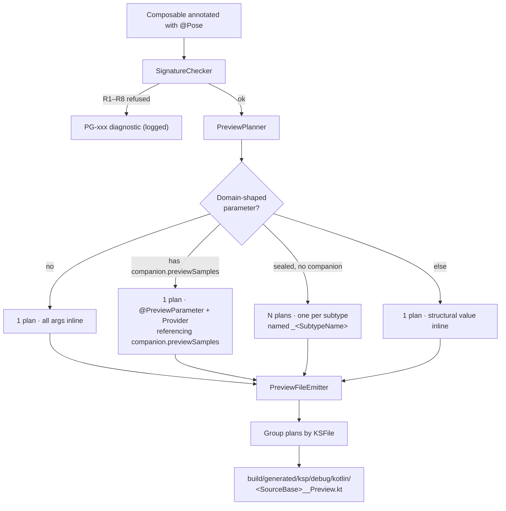

# Contributing to Pose

Thanks for considering a contribution.

## Development

```bash
./gradlew build          # compiles all modules + runs tests
./gradlew :processor:test
```

Requires JDK 17. Gradle wraps everything else.

## Project layout

| Coordinate                                  | Purpose                                                                     | Configuration in consumers |
|---------------------------------------------|-----------------------------------------------------------------------------|----------------------------|
| `io.github.akshaychordiya.pose:annotations` | The `@Pose` marker (pure Kotlin JVM JAR, no Compose deps)                   | `implementation`           |
| `io.github.akshaychordiya.pose:processor`   | The KSP2 symbol processor (pure Kotlin JVM JAR)                             | `kspDebug`                 |
| `sample-app`                                | End-to-end smoke test showing the plugin running against a real Android app | not published              |

The annotations JAR is intentionally minimal — one annotation class, no runtime dependencies. Consumers of Pose should not accidentally pull in Compose tooling just by depending on the marker.

The processor consumes `symbol-processing-api` and `kotlinpoet-ksp`; it never depends on the annotations JAR at runtime (only reads the annotation FQN from source symbols).

## Processor pipeline



Key invariants:

- **KSP can only emit new files, not modify existing ones.** Every generated preview lives in the `build/generated/` tree; the developer's source is never touched.
- **Determinism.** Sample values are seeded from a hash of `(composable FQN, parameter path, type FQN)`. No `Random`, no clock, no classpath-iteration-order.
- **One file per KSFile.** All previews for composables declared in `Foo.kt` land in `Foo__Preview.kt`. The emitter groups plans by containing file and writes each grouped file once.

## Where each concern lives

| Concern                                                                                | File                      |
|----------------------------------------------------------------------------------------|---------------------------|
| Detect `@Pose` annotation, drive the pipeline                                          | `PoseProcessor`           |
| Validate signature (visibility, receivers, generics, refuse-category params)           | `SignatureChecker`        |
| Decide the emission shape (inline vs companion vs sealed fan-out)                      | `PreviewPlanner`          |
| Recursive structural synthesis of values                                               | `SampleResolver`          |
| Well-known types (Compose value classes, `Flow`, `java.time`, refuse-category list)    | `FqnTable`                |
| Function-type lambda placeholders (`() -> Unit`, `@Composable BoxScope.() -> Unit`, …) | `FunctionTypeSynthesizer` |
| KotlinPoet-based file writing                                                          | `PreviewFileEmitter`      |
| KSP-arg parsing                                                                        | `Options`                 |
| Diagnostic codes + strict/lenient routing                                              | `Diagnostics`             |

## CMP-forward design notes

The current implementation is Android-only, but the shape is intentionally close to what Compose Multiplatform support will need:

- **FQN table entries assume the key type's artifact provides every symbol the emitter references.** Today this is safe (e.g. `Painter → ColorPainter(Color(...))` — all in `androidx.compose.ui:ui-graphics`). Future cross-artifact entries will need per-entry symbol-availability checks against the current compilation's classpath. Extend `FqnTable.Emitter` with a `requiredFqns: Set<String>` field and gate lookup in `SampleResolver` when that day arrives.
- **Variant selection is the consumer's job, not the processor's.** Consumers pick `kspDebug`, `kspStaging`, `kspCommonMainMetadata`, etc. in their Gradle file — the processor never needs to know which variant it's running for. Don't reintroduce a `pose.variants` knob.
- **The `annotations` module has zero platform-specific code.** It's currently `kotlin("jvm")` for convenience but converts to `kotlin("multiplatform")` with a single `commonMain` sourceset as a pure Gradle change when we start the CMP push.
- **The processor is JVM-only forever.** KSP2 processors run at build time on JVM regardless of the target the generated code is going into.

## Common contribution shapes

### Adding a type to the FQN table

Extend `FqnTable.SimpleEmitters` (fixed expression) or `FqnTable.GenericEmitters` (recursive on a type argument). Prefer types that appear commonly in production Compose signatures — one-off vendor types belong in a wrapper you own, not in the frozen table.

Add a test in `processor/src/test/kotlin/` covering the new entry.

### Adding a refusal rule

Extend `SignatureChecker` or the `SampleResolver` path. Assign a new `DiagnosticCode` (`PGxxx`) and update:

- `Diagnostics.kt` — the enum entry
- `README.md` — the refusal list (if it's a user-visible one)
- Corresponding test in `RefusalTest.kt`

### Adding a KSP option

Extend `Options` (the data class + `from()` parser). Document it in `README.md`'s option table and `PoseProcessor`'s usage. Add coverage in `OptionsTest.kt`.

## Testing conventions

Tests use [`dev.zacsweers.kctfork`](https://github.com/tschuchortdev/kotlin-compile-testing) (a KSP2-aware fork of `kotlin-compile-testing`). Each test:

1. Constructs a `SourceFile.kotlin` fixture with a small composable
2. Runs it through `CompileHarness.compile(...)`
3. Asserts on either the generated file contents (`generatedFile("Foo__Preview.kt").readText()`) or the compiler messages (for refusals)

Don't mock KSP internals — the compile-testing harness gives you real behavior.

## Style

- KDoc on public API, keep it minimal — WHY, not WHAT.
- `explicitApi()` is enabled on the annotations and processor modules; declare visibility.
- No comments on obvious code. Comments explain non-obvious constraints or workarounds.
- Deterministic output: never `Random`, never clock, never classpath-iteration-order.

## Reporting issues

Please include:

- Kotlin, KSP, AGP, and Compose BOM versions.
- Minimal repro composable + the `PG-xxx` diagnostic if one fired.
- Generated file contents (if any) from `build/generated/ksp/debug/kotlin/`.
