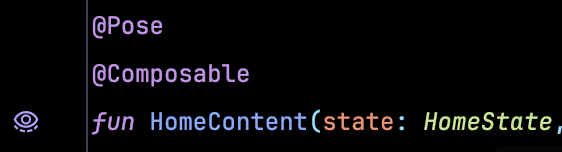

# Pose 🏞️✨

[](https://central.sonatype.com/namespace/io.github.akshaychordiya.pose)
[](https://plugins.jetbrains.com/plugin/33344-pose--auto-generate-compose-previews)
[](https://opensource.org/licenses/Apache-2.0)
[](https://kotlinlang.org)
[](https://github.com/AkshayChordiya/Pose/actions/workflows/ci.yml)

**Auto-generate Jetpack Compose `@Preview` functions from your `@Composable` code at build-time, deterministic, offline, no LLM.**

Your composable strikes a **Pose** for the preview panel. Annotate, build, done. ✨

```kotlin
@Composable
@Pose
fun LoginContent(state: LoginUiState, onSubmit: () -> Unit) { /* … */ }
```

Every build regenerates into `build/generated/ksp/debug/kotlin/`:

```kotlin
@PreviewLightDark @Composable
internal fun LoginContent__Preview() {
    AppTheme {
        LoginContent(
            state = LoginUiState(email = "Email", password = "Password", isSubmitting = false, error = null),
            onSubmit = {},
        )
    }
}
```

- Never checked in — regenerates on every build 🔄
- Always in sync with the composable signature 🎯
- Zero maintenance 🧘

---

## Why 🤔

Compose's preview ecosystem is great at **consuming** previews (Showkase, Paparazzi, Roborazzi, Google's screenshot-testing plugin) but has no build-time story for **generating** them.

- Gemini's *Generate Preview* and IDE plugins write source you have to maintain 🤖
- Hand-written previews rot the moment the composable signature changes 📝
- Pose never touches your source. Files land in `build/generated/`, always fresh ✍️

## Install 🔧

```kotlin
plugins { id("com.google.devtools.ksp") }

dependencies {
    implementation("io.github.akshaychordiya.pose:annotations:0.5.0")
    kspDebug("io.github.akshaychordiya.pose:processor:0.5.0")

    implementation("androidx.compose.ui:ui-tooling-preview")
    debugImplementation("androidx.compose.ui:ui-tooling")
}

ksp {
    // Fully qualified name of your Theme composable
    arg("pose.themeFqName", "com.example.ui.AppTheme")
}
```

**Requirements**

- Kotlin **2.0+**, KSP **2.x**
- AGP **8.2+**, Compose BOM **2024.02+**
- JDK **17+**

Tested on Kotlin 2.4.x · KSP 2.3.x · AGP 9.2.x.

**About `pose.themeFqName`** - must be a composable with the signature `fun ThemeName(content: @Composable () -> Unit)`. Extras are OK if they're defaulted. Leave unset and Pose skips the theme wrapper (with one build-init warning).

## Use ✨

Annotate any composable:

```kotlin
@Pose
@Composable
fun MyScreen(state: UiState, onEvent: (Event) -> Unit) { /* … */ }
```

### IDE plugin: gutter icons + jump-to-preview 🎨



Install the companion **[Pose IntelliJ plugin](https://plugins.jetbrains.com/plugin/33344-pose--auto-generate-compose-previews)** — either from the Marketplace page directly, or from inside your IDE:

1. `Settings → Plugins → Marketplace`
2. Search *Pose - Auto generate Compose Previews*
3. Click **Install**
4. Restart your IDE

You then get:

- 👁️ **Gutter icon** next to every composable Pose generates a preview for both explicit `@Pose` *and* bulk-mode composables without one
- 🖱️ **Click to jump** into the matching `<Composable>__Preview*` function inside the generated file
- 🎯 **Popup chooser** for sealed fan-outs — pick `_Loading` / `_Success` / `_Error` and land there directly

Requires Android Studio Ladybug (2024.2) or newer. K1 and K2 modes both supported. Optional but recommended - the KSP processor works standalone; the plugin just removes the need to open `build/generated/` by hand.

### Sealed states, one preview per subtype 🌿

```kotlin
sealed interface HomeState {
    data object Loading : HomeState
    data class Success(val user: User) : HomeState
    data class Error(val message: String) : HomeState
}

@Pose
@Composable
fun HomeContent(state: HomeState) { /* … */ }
```

Emits three named preview functions:

- `HomeContent__Preview_Loading`
- `HomeContent__Preview_Success`
- `HomeContent__Preview_Error`

Studio labels each render by its subtype name - the preview panel reads cleanly at a glance.

### Rich sample data with `companion.previewSamples` 🧪

For empty / error / long-text / edge-case variants, expose a sequence on the type's companion:

```kotlin
data class LoginUiState(...) {
    companion object {
        val previewSamples: Sequence<LoginUiState> = sequenceOf(
            LoginUiState(email = "", …),
            LoginUiState(isSubmitting = true, …),
            LoginUiState(error = "Invalid", …),
        )
    }
}
```

Pose wires it through `@PreviewParameter` automatically. **Write once, benefit everywhere** - every composable that takes `LoginUiState` now shows all variants.

### Bring your own `PreviewParameterProvider` 🧺

Don't own the type? Want composable-scoped sample data without polluting the model? Attach a `PreviewParameterProvider<T>` at the annotation:

```kotlin
class ArticleSamples : PreviewParameterProvider<Article> {
    override val values = sequenceOf(
        Article(title = "Hello world",  body = "First paragraph"),
        Article(title = "Longer post",  body = "Longer body with more text"),
    )
}

@Pose(providers = [PoseProvider(ArticleSamples::class)])
@Composable
fun ArticleCard(
    article: Article,           // ← auto-matched to ArticleSamples by generic type
    onOpen: () -> Unit,
) { /* … */ }
```

Pose walks each entry's `PreviewParameterProvider<T>` supertype, extracts `T`, and matches it against the composable's parameter types. Emits `ArticleSamples().values.first()` inline. Providers stay scoped to this composable — they never leak into others.

**Disambiguating same-typed parameters** -> name them explicitly with `forParam`:

```kotlin
@Pose(providers = [
    PoseProvider(ArticleSamples::class,         forParam = "left"),
    PoseProvider(FeaturedArticleSamples::class, forParam = "right"),
])
@Composable
fun ArticleComparison(left: Article, right: Article) { /* … */ }
```

Named binding always wins over generic-type binding when both would apply.

### Preview matrix from one multipreview annotation 🎛️

Bundle every dimension your team cares about into one annotation:

```kotlin
@Preview(name = "Light",     uiMode = UI_MODE_NIGHT_NO)
@Preview(name = "Dark",      uiMode = UI_MODE_NIGHT_YES)
@Preview(name = "RTL",       locale = "ar")
@Preview(name = "Font 1.5×", fontScale = 1.5f)
@Preview(name = "Landscape", widthDp = 640, heightDp = 360)
@Retention(AnnotationRetention.BINARY)
@Target(AnnotationTarget.FUNCTION, AnnotationTarget.ANNOTATION_CLASS)
annotation class AppPreviews

@Composable @Pose(previews = [AppPreviews::class])
fun MyChip(...) { /* … */ }
```

Adding a new dimension (dynamic-color, foldables, tablet-size) is a **one-line edit** that ripples through every generated preview. Default is Pose's own light + dark pair with `showBackground = true`.

### `LocalInspectionMode` and custom CompositionLocals 🔌

Generated previews are wrapped in `CompositionLocalProvider(LocalInspectionMode provides true)` automatically:

```kotlin
internal fun PhotoViewer__Preview() {
  CompositionLocalProvider(LocalInspectionMode provides true) {
    AppTheme {
      PhotoViewer(url = "Url")
    }
  }
}
```

**Why this matters** — Android Studio's preview renderer sets `LocalInspectionMode` for you, but snapshot runners (Paparazzi, Roborazzi, `com.android.compose.screenshot`) leave it `false`. A composable that branches on it:

```kotlin
@Composable
fun PhotoViewer(url: String) {
    if (LocalInspectionMode.current) {
        Image(painterResource(R.drawable.placeholder), null)   // static fallback
    } else {
        AsyncImage(model = url, contentDescription = null)      // real network call
    }
}
```

…would render correctly in Studio but fall through to the production path in a snapshot test — attempting a network fetch with a dummy URL and producing a blank image. Pose provides the local so both environments agree.

Opt out with `arg("pose.provideInspectionMode", "false")`.

**Need other CompositionLocals?** Point `pose.previewWrapperFqName` at your own wrapper composable — same trailing-lambda contract as `pose.themeFqName`:

```kotlin
@Composable
fun PreviewWrapper(content: @Composable () -> Unit) {
    CompositionLocalProvider(
        LocalImageLoader provides fakeImageLoader(),
        LocalAnalytics provides NoOpAnalytics,
    ) { content() }
}
```

```kotlin
ksp {
    arg("pose.themeFqName", "com.example.ui.AppTheme")
    arg("pose.previewWrapperFqName", "com.example.ui.PreviewWrapper")
}
```

Nesting, outermost first: **inspection-mode provider → your wrapper → theme → target composable**. Your wrapper sits inside Pose's provider deliberately — innermost `CompositionLocalProvider` wins, so you keep the final say over any local Pose also sets.

## Snapshot testing - the multiplier 📸

Every `@Pose` composable becomes a **free visual regression test** with Paparazzi, Roborazzi, or Google's `com.android.compose.screenshot` — with **zero extra test code**.

**Google's screenshot testing plugin**

```kotlin
androidComponents {
    onVariants(selector().withBuildType("debug")) { variant ->
        variant.sources.screenshotTest?.addStaticSourceDirectory(
            layout.buildDirectory.dir("generated/ksp/debug/kotlin").get().asFile.path
        )
    }
}
```

**Paparazzi / Roborazzi** (via [ComposablePreviewScanner](https://github.com/sergio-sastre/ComposablePreviewScanner))

```kotlin
class PoseSnapshotTest {
    @get:Rule val paparazzi = Paparazzi()
    @TestParameter lateinit var preview: ComposablePreview<AndroidPreviewInfo>

    @Test fun snapshot() = paparazzi.snapshot { preview() }

    companion object {
        @JvmStatic fun previews() =
            AndroidComposablePreviewScanner().scanPackageTrees("com.example").getPreviews()
    }
}
```

The lifecycle takes care of itself:

- Add a composable - next CI run adds a golden to review ➕
- Rename it - the golden name tracks automatically 🔤
- Delete it - the golden disappears 🗑️

Visual regression coverage stops being separate work. It's the annotation you already added for previews.

## How values are synthesized 🎨

Per parameter, first match wins (top-down):

| Tier         | Rule                                                                                                                |
|--------------|---------------------------------------------------------------------------------------------------------------------|
| **Explicit** | `@Pose(providers = [PoseProvider(...)])` binding matches (named `forParam` first, then generic-type)                |
| **T0**       | Parameter has a default value - omit the argument                                                                   |
| **T1**       | Well-known FQN (Compose value classes, `Flow`, `StateFlow`, `java.time`, `Uri`, `Result<T>`, …) - inline expression |
| **T2**       | Structural synthesis (primitives, enums, data classes, sealed, value classes, function types, collections)          |
| **Refuse**   | No strategy - emits a `PG-xxx` diagnostic and skips                                                                 |

Deterministic - never `Random`, never clock, never classpath-iteration order.

## Refused composables 🛑

Pose emits actionable `PG-xxx` diagnostics for:

- **Refuse-list parameter types**: `ViewModel`, Hilt, `SavedStateHandle`, `NavController`, `NavBackStackEntry`, `Context`/`Activity`/`Fragment`, `Bitmap`, `Channel`, `CoroutineScope`, `AsyncImagePainter`. Hoist state to a `Content(state, onEvent)` variant.
- **Generic type parameters** or **context receivers** on the composable.
- **`private` visibility**, or **member composables** must be top-level or in an `object`.

Every refusal message names the composable, gives a concrete fix, and links to the [refusal catalog](docs/refusals.md).

### Bulk opt-in for whole-module coverage 🚀

For teams that want previews everywhere without annotating each composable, flip one flag:

```kotlin
ksp {
    arg("pose.themeFqName", "com.example.ui.AppTheme")
    arg("pose.generatePreviewsForAllPublicComposables", "true")
}
```

Every public top-level `@Composable fun … : Unit` in the module now gets a generated preview. Bulk mode implicitly sets `pose.strict = false` — a single un-fakeable composable turns into a warning-and-skip instead of failing the build.

Opt individual composables back out with `@PoseIgnore`:

```kotlin
@PoseIgnore
@Composable
fun DebugOverlay(state: DebugState) { /* … */ }   // public but noisy in the preview panel
```

Pose also skips any composable that already carries `@Preview`, and honors explicit `@Pose(...)` arguments (name / wrapInTheme / previews / providers) when both are present.

## KSP options 📋

| Option                                              | Default | Behavior                                                                                    |
|-----------------------------------------------------|---------|---------------------------------------------------------------------------------------------|
| `pose.themeFqName`                                  | *unset* | Theme composable to wrap generated calls in                                                 |
| `pose.strict`                                       | `true`  | `false` demotes refusals (PG001, PG002, PG003, PG010, …) to warnings                        |
| `pose.generatePreviewsForAllPublicComposables`      | `false` | Bulk opt-in — every public composable gets a preview. Implicitly sets `pose.strict = false` |
| `pose.maxDepth`                                     | `8`     | Cap on recursion depth for structural synthesis                                             |
| `pose.collectionSize`                               | `2`     | Elements emitted for `List` / `Set`                                                         |
| `pose.maxPreviewsPerComposable`                     | `8`     | Cap on total previews per composable                                                        |
| `pose.verboseSkips`                                 | `false` | Log every skip decision                                                                     |
| `pose.provideInspectionMode`                        | `true`  | Wrap previews in `CompositionLocalProvider(LocalInspectionMode provides true)`               |
| `pose.previewWrapperFqName`                         | *unset* | Composable wrapping every preview, for supplying arbitrary `CompositionLocal`s              |

## Platforms 🌍

- **Android** — first-class, tested end-to-end via the sample-app.
- **Kotlin Multiplatform / Compose Multiplatform** — verified working on real CMP + KMP projects. `androidx.compose.ui.tooling.preview.Preview` unified across Android and CMP, so Pose's emission works on both. Wire the processor into the appropriate `ksp<Target>Main` configuration in your module's `build.gradle.kts`.

## Limitations 🚧

- **Body-level analysis** — Pose only sees signatures. A composable that internally calls `hiltViewModel()` or reads a `LocalContext` may crash at preview render. Hand-write a `@Preview` for those (Pose skips), or refactor to stateless.
- **Other non-goals** — ViewModel/Hilt params (refused by design — split into `Screen(vm) / ScreenContent(state, onEvent)` per [PG003](docs/refusals.md#pg003)), runtime fake-data libs, context params, default-expression forwarding ([KSP #268](https://github.com/google/ksp/issues/268)).

## Contributing 🤝

See [CONTRIBUTING.md](CONTRIBUTING.md) for project layout, the processor pipeline diagram, and how to add types or refusal rules.

Also see the [refusal catalog](docs/refusals.md) and the [changelog](CHANGELOG.md).

## License 📄

Apache 2.0. See [LICENSE](LICENSE).
